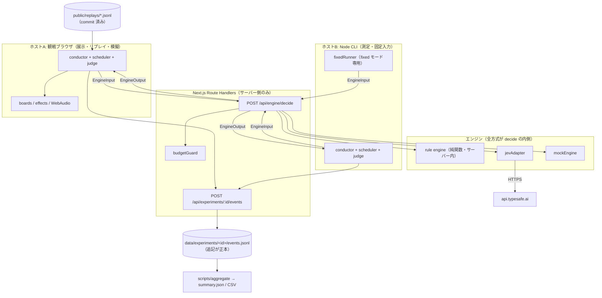
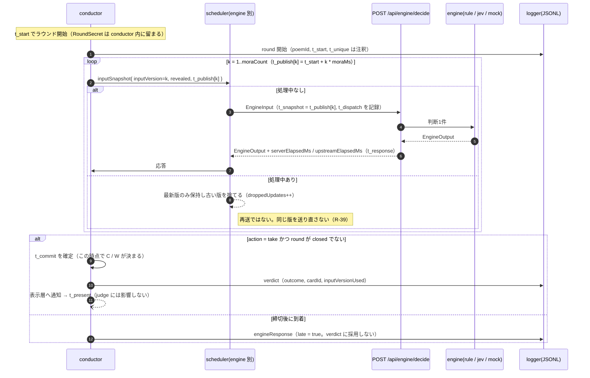
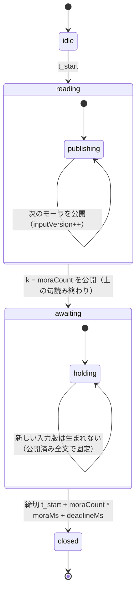
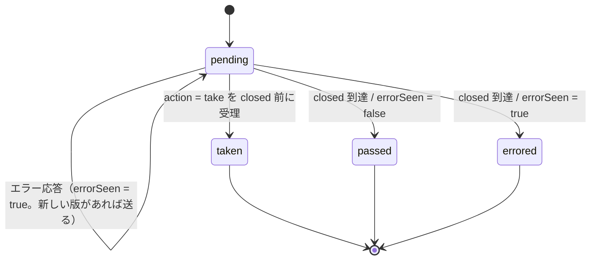
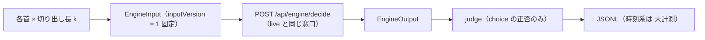

# 02 アーキテクチャ（D3）

対象: 百人一首AIタイムアタック 初期版。
出典: `docs/00_proposal.md`（企画書 v1.0、以下「§n」）、`docs/01_requirements.md`（以下「R-xx」）、`docs/plan_review.md` の裁定表（以下「裁定#n」）。

## この文書の役割

- **境界・名前・順序・その理由**だけを書く。型の中身（フィールド1件ごとの定義）・API スキーマ・画面ワイヤーは書かない（D4〜D6 と実コードが正本）。
- `src/core` は**まだ存在しない**。したがって本文書の「正準名表」が、P1 実装が踏襲すべき名前の正本である。P1 は本表の名前でファイル・型・イベントを作る。
- **P1 完了後は `src/core/*.ts` が正本になり、本表が実コードへ追従する**。乖離を見つけたら実コードではなく本表を直す。
- 「なぜこの形か / なぜ別の形にしなかったか」は最終節と `docs/adr/`（D9）に置く。

---

## 1. 全体構成

同じ `conductor` を、観戦ブラウザ（展示10問）と Node CLI（100首×3 測定）の2つのホストで動かす。`src/core` は DOM 非依存の純 TS で、時計は注入する。

### 境界の理由

| 境界 | 決めたこと | なぜ | 根拠 |
|---|---|---|---|
| core とホスト | `src/core` は DOM も `fetch` の既定実装も持たない。時計と送信関数を注入する | 展示（ブラウザ）と測定（Node）で**同一の conductor** を動かさないと、比較条件が2つに割れる | §9-4 |
| 全方式 → 同一窓口 | rule も mock も `/api/engine/decide` を通る。rule をクライアント内で直接呼ばない | 片方だけ HTTP 往復を免れると速度比較が成立しない。内訳は `serverElapsedMs` / `upstreamElapsedMs` で分離して残す | R-18 |
| 鍵と外部通信 | `jevAdapter` と API キーはサーバー側だけに置く。稼働確認は `jevConfigured: boolean` のみ返す | ブラウザへ鍵を渡さない | R-40 |
| 費用の停止点 | `budgetGuard` は `decide` の内側、エンジン呼び出しの**手前**に置く | 上限判定をエンジンごとに書くと漏れる。1箇所で止め、超過は `budget_exhausted` として記録し成績から隠さない | R-37, R-39 |
| 実呼び出しの既定 | `LIVE_MODE` 既定 off。off のとき `jev` を指定しても外部通信しない | 公開サイトで費用が暴走しない | R-38 |
| 保存 | DB を持たない。JSONL 追記が正本、`summary.json` は派生 | 再集計で一致を検証でき、そのまま公開できる | R-23 |
| 公開サイト | Vercel 上は commit 済みリプレイ・模擬・説明のみ。実測はローカル Node | Vercel の FS は揮発するため、追記ログを正本にできない | R-38, ADR-0004 |

---

## 2. ラウンドのシーケンス（live 逐次試験）

`reading` 中はモーラが1件ずつ公開され、公開のたびに新しい入力版が生まれる。`scheduler` はエンジンごとに処理中1件だけを許し、処理中に生まれた版は**最新1件へ集約**する（取りこぼした数は `droppedUpdates`）。

- **t_commit は有効応答を受け取った時点**で決まり、演出の長さに影響されない。`t_present` は表示層だけの時刻（R-17）。
- 締切後に届いた応答は `late = true` でログに残し、当ラウンドの判定にも**次ラウンドにも**使わない（R-08）。
- `inputVersionUsed` は「そのエンジンがどの版を見て判断したか」。誤りの分類はこの版で行い、応答の到着時刻では行わない（R-22）。
- 公開は1モーラ単位で、未公開のモーラは `revealed` に入らない（R-12）。`RoundSecret`（正解・出題順・seed）は `EngineInput` の型に存在しない（R-11, R-15）。

参照: R-07 / R-08 / R-12 / R-16 / R-19 / R-22。

---

## 3. ラウンド状態機械

エンジンごとの状態は round 状態とは別に持つ。

### この形にした理由（D3 の裁定）

| 論点 | 決めたこと | なぜ |
|---|---|---|
| `deadline` は状態か時刻か | **時刻**。状態は `reading → awaiting → closed` の3つ。r1 が `deadline(...)` と書いていたものを `awaiting` 状態＋締切時刻へ分解した | `stateDiagram` に落とすと「読み終わってから締切まで」は滞在時間のある状態で、締切はその出口イベント。混ぜると「締切状態に何秒いるか」という無意味な問いが出る |
| 全エンジンが `taken` になったら早く閉じるか | **閉じない。`closed` は締切到達のみ** | 遅着（`late`）の基準時刻を締切に固定するため。早期クローズすると、処理中だった応答が本来の締切前なのに `late` と記録される。演出・次問への進行は表示層が早めてよく、`closed` とは独立（R-17 の逆向き） |
| エラー応答は終端か | **終端ではない**。`errorSeen` を立てて `pending` に留まる | 新しい入力版を送るのは**再試行ではない**（別の入力）。R-39 が禁じているのは同一リクエストの送り直し。`budget_exhausted` の後は新規送信が止まるので、結果的に `pending` のまま締切を迎える |
| `passed` と `errored` の優先 | エラー履歴があれば `errored`（→ E）。なければ `passed`（→ M） | 通信障害を「慎重に見送った」に混ぜない（R-20, §8） |
| `taken` 後の応答 | 無視する。ログには残す | 取得は1問1回（R-07） |

判定の対応: `taken` → 札が正解なら C / 違えば W、`passed` → M、`errored` → E。4種の合計はラウンド数 N に一致する（R-20）。

---

## 4. `fixed` モード（固定入力試験）の経路

`fixed` は**時計と締切を使わない**（R-27）。したがって上の状態機械は通らない。conductor の代わりに `fixedRunner` が動く。

- k は `決まり字長` / `決まり字長 + 1` / 明示の数値 から指定する。
- 1ラウンドあたり**各方式ちょうど1リクエスト**。`scheduler` の集約も `droppedUpdates` も発生しない。
- `t_start` 以下の時刻系指標は記録せず「未計測」として出す（空欄にしない）。
- 窓口は live と同じ `/api/engine/decide` を使う。公平性の経路を2つに分けないため（R-18）。
- 較正用の接続確認スクリプト（P0 `scripts/probe-jev.ts`）は較正専用であり、`fixed` 試験の代わりにしない（裁定#32）。

---

## 5. 時刻の記録点

記録する時刻は企画書§8 の7点（R-16）。**呼び出し主体の単一の単調増加時計**で取り、別端末・API サーバーの時計を差し引かない。

| 記号 | 誰が記録するか | 備考 |
|---|---|---|
| `t_start` | conductor | ラウンド開始 |
| `t_unique` | conductor（注釈） | 決まり字長番目のモーラ公開時刻。**エンジンへ渡さない**（R-15） |
| `t_snapshot` | scheduler | そのリクエストに載せた入力版が公開された時刻 |
| `t_dispatch` | scheduler | 送信時刻 |
| `t_response` | scheduler | 応答全体の受信時刻 |
| `t_commit` | conductor | 有効な取得の確定時刻。演出に影響されない |
| `t_present` | 表示層 | エフェクト表示時刻。judge に影響しない |

**`t_publish[k]` と `t_snapshot` の関係**（r1 と企画書で語が違ったので確定させる）:
`t_publish[k]` は「モーラ k が公開された時刻」で、入力スナップショット側の属性（`inputSnapshot.t_publish`）。`t_snapshot` は「あるリクエストが載せた版の公開時刻」で、リクエスト側の属性。値としては `t_snapshot = t_publish[inputVersion]`。**別名ではなく別のもの**なので、両方の語を残す。

サーバー内の処理時間は `serverElapsedMs`（Route Handler が自分で測った経過）、Jev の上流往復は `upstreamElapsedMs` として、往復時間 `t_response − t_dispatch` とは**別の値**で保存する（R-16, R-18）。

---

## 6. 正準名表（P1 はこの名前で実装する）

D3 の Gate はこの表である。以降の文書・実装は、ここにある綴りを使う。

### 6.1 モジュール

| 名前 | 置き場所 | 役割 |
|---|---|---|
| `poems` | `src/core/poems.ts` | 百首マスタ読み込み・かな正規化・決まり字長の派生（R-01〜R-03） |
| `conductor` | `src/core/conductor.ts` | ラウンド状態機械、モーラ公開、`RoundSecret` 保持、`t_commit` 確定 |
| `scheduler` | `src/core/scheduler.ts` | エンジンごと処理中1件、最新版への集約、`droppedUpdates`（R-19） |
| `judge` | `src/core/judge.ts` | `outcome` と `ambiguityClass` の決定（R-20, R-22） |
| `engine` | `src/core/engine.ts` | `EngineInput` / `EngineOutput` の契約 |
| `ruleEngine` | `src/core/engines/rule.ts` | 正規化 yomi の前方一致。候補ちょうど1件で `take`（R-06） |
| `jevAdapter` | `src/core/engines/jev.ts` | 101選択肢 Choice 1問。サーバー側のみ |
| `mockEngine` | `src/core/engines/mock.ts` | 決定的。遅延・誤答・エラー注入可。常に「模擬」表示（R-32） |
| `budgetGuard` | `src/core/budget.ts` | `maxCalls` / `maxCostUsd` で停止（R-37） |
| `log` | `src/core/log.ts` | JSONL イベントの型と追記。**属性名の正本は D4** |
| `fixedRunner` | `src/core/fixed-runner.ts` | `fixed` モードの実行（R-27） |
| `aggregate` | `scripts/aggregate.ts` | 指標の再計算（R-21, R-23） |

`CLAUDE.md` のディレクトリ規則は3方式を `src/core/` 直下に並べて書いているが、本表は `src/core/engines/` へまとめた。3つが `EngineInput → EngineOutput` という**同一の差し替え可能な契約**を実装する唯一のグループで、conductor / scheduler / judge（差し替えない部品）と同じ階層に置くと役割が読めなくなるため。P1 でこの配置を採ったら `CLAUDE.md` の木も合わせる。
| `measure` | `scripts/measure.ts` | 測定 CLI。反復ごとの seed と出題順生成（R-28） |

### 6.2 型・値

| 種別 | 正準名 |
|---|---|
| 型 | `EngineInput`, `EngineOutput`, `RoundSecret`, `InputSnapshot`, `ExperimentConfig` |
| 実験モード（4種・R-26） | `exhibit` \| `measure` \| `fixed` \| `mock` |
| ラウンド状態 | `idle` \| `reading` \| `awaiting` \| `closed` |
| エンジン状態 | `pending` \| `taken` \| `passed` \| `errored` |
| 判定 | `C` \| `W` \| `M` \| `E` |
| 誤りの分類（R-22） | `premature` \| `post_unique_miss` \| `input_normalization` \| `implementation_transport` |
| エラー種別（5種） | `timeout` \| `http` \| `invalid_response` \| `budget_exhausted` \| `rate_limited` |
| 行動 | `take` \| `wait` |
| 候補順 | `id_asc` |
| フィールド | `inputVersion`, `inputVersionUsed`, `revealed`, `moraCount`, `serverElapsedMs`, `upstreamElapsedMs`, `engineElapsedMs`, `droppedUpdates`, `late`, `configVersion`, `dataVersion`, `promptVersion`, `jevConfigured` |
| 時刻 | `t_start`, `t_unique`, `t_snapshot`, `t_dispatch`, `t_response`, `t_commit`, `t_present`, `t_publish` |

**綴りの規約**: TypeScript の型・フィールドは camelCase。時刻の記号だけは企画書§8 の表記（`t_snake`）をそのまま使う — 企画書・要件・指標式で繰り返し出る記号で、言い換えると突き合わせができなくなるため。
**JSONL の属性名は本文書で確定しない**。D4（`docs/03_data_model.md`）が `src/core/log.ts` と一致させる。

**r1 から綴りを変えたもの / 本文書で新たに名付けたもの**（P1 は変更後を使う）:

| 対象 | r1 | D3 | なぜ |
|---|---|---|---|
| エンジン状態の第4値 | `error` | `errored` | `EngineOutput.error`（エラー内容を持つフィールド）と同じ綴りだと、`engine.error` が状態なのか内容なのか読めない |
| 誤りの分類 | 日本語のみ（先読み失敗 / 特定後ミス / 入力問題 / 実装通信） | `premature` / `post_unique_miss` / `input_normalization` / `implementation_transport` | R-22 は分類の意味だけを決めており、識別子は未採番だった。集計列・JSONL の値として使うため本文書で採番した。表示の日本語ラベルは D6 が決める |
| ラウンド状態 | `idle → reading → deadline → closed` | `idle → reading → awaiting → closed` | 上の §3 の裁定（締切は時刻であって状態ではない） |

---

## 7. なぜこうしなかったか（Why not）

| 採らなかった案 | なぜ |
|---|---|
| Trie / オートマトンの rule engine | 100件の前方一致はマイクロ秒台で、比較の律速にならない。単純走査のほうが「なぜ取ったか」を説明できる（ADR-0001） |
| DB を置く | ログが正本なら再集計で検証でき、そのまま公開できる。DB を挟むと「集計が正しいか」を確かめる経路が増える（ADR-0002） |
| rule をクライアント内で直接実行 | 片方だけ HTTP 往復を免れ、速度比較が条件の違う2つの測定になる（ADR-0003） |
| 実測を Vercel 上で行う | FS が揮発し追記ログを正本にできない。公開のまま実呼び出しを許すと費用が制御できない（ADR-0004） |
| エラー時のリトライ | 再試行を入れると「速い方式」ではなく「再試行回数の少ない方式」を測ることになる。429/529 は E として件数を出す（ADR-0005、R-39） |
| 実録音の読み上げ | 公開時刻の厳密さと素材工数。合成モーラ時計なら公開時刻が定義から決まる。実録音は段階6で音声認識と同時（ADR-0006） |
| エンジンへ `t_unique` を渡す / そこに合わせて呼ぶ | 答え情報を渡すのと同じ。評価用の注釈に留める（R-15、§8） |

---

## 8. 本文書で確定しなかったもの

| 項目 | 送り先 |
|---|---|
| JSONL の属性名・イベント表・ER 図 | D4 `docs/03_data_model.md` |
| エンドポイントの入出力スキーマ | D5 `docs/04_api.md` + `docs/openapi.yaml` |
| 6画面のワイヤー・演出表 | D6 `docs/05_screen_design.md` |
| 指標式・公平性12項目・誤り分類の運用 | D7 `docs/06_measurement_protocol.md` |
| T-xx と Vitest ファイル名の 1:1 対応 | D8 `docs/07_test_plan.md` |
| 確信度の閾値 θ、プロンプト版（`P1-kana` / `P2-romaji`）の採用版 | 段階0（P0）の較正後に config へ固定 |
| `moraMs` / `deadlineMs` / `timeoutMs` の既定値 | ExperimentConfig の既定として P1 で定め、実験記録に残す（R-10, R-29） |

**未検証**: 本文書の Mermaid はローカルでレンダリング検証していない（`mmdc` の導入は依存追加に当たるため）。GitHub 上の描画で確認する。
