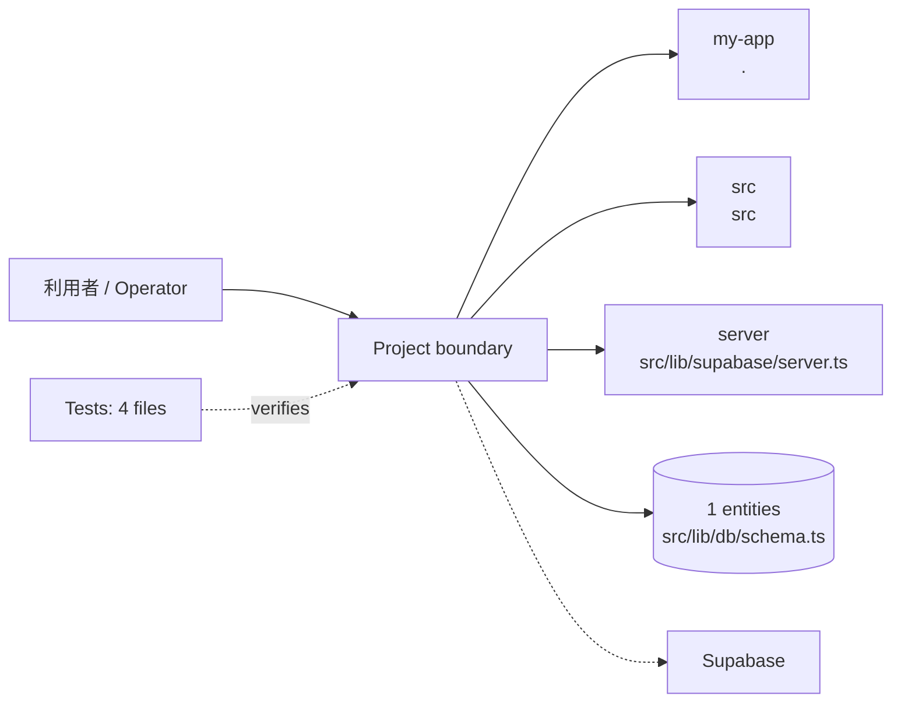
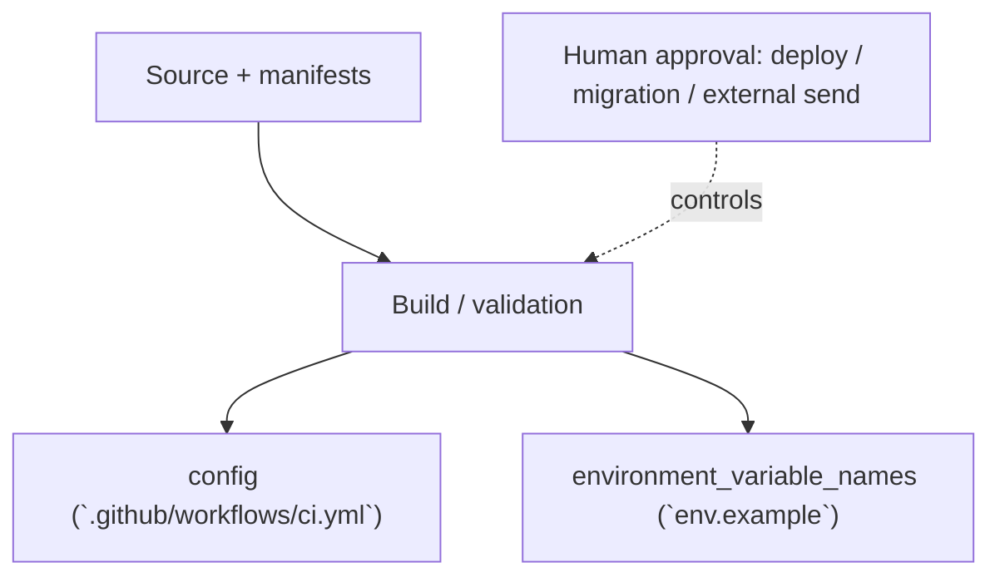

<!-- generated-by: scripts/generate_engineering_docs.py -->
# _starter_nextjs — アーキテクチャ・システム構成

> 生成日: 2026-07-15 / 対象: `_starter_nextjs` / 確度: [高]
> 実装・manifest・既存資料の静的棚卸しに基づく。外部サービスの稼働状態と本番構成は未検証。

## 論理アーキテクチャ

## 配備・実行構成

## コンポーネント責務

| Component | Path | 責務 |
|---|---|---|
| `my-app` | `.` | 責務は実装と既存READMEを確認 |
| `src` | `src` | 中核実装。詳細は配下moduleを参照 |
| `server` | `src/lib/supabase/server.ts` | 実行entrypoint |

### 検出したruntime / service

- `config (`.github/workflows/ci.yml`)`
- `environment_variable_names (`env.example`)`

## 実装境界

- UI/入口: `src/app/page.tsx`
- API: API route未検出
- Data: `src/lib/db/schema.ts`
- External: Supabase

## セキュリティ境界

- 認証・回復性の実装シグナル: auth/session (`src/lib/env.ts`), auth/session (`src/lib/supabase/middleware.ts`), tenant/RLS (`src/lib/supabase/client.ts`), auth/session (`src/lib/supabase/server.ts`), tenant/RLS (`src/lib/db/schema.ts`)
- 設定名: DATABASE_URL, NEXT_PUBLIC_SUPABASE_URL, NEXT_PUBLIC_SUPABASE_ANON_KEY, DATABASE_URL, APP_URL, NODE_ENV, NEXT_PUBLIC_SUPABASE_URL, NEXT_PUBLIC_SUPABASE_ANON_KEY, NEXT_PUBLIC_STRIPE_PUBLISHABLE_KEY（値は収集していない）
- deploy、migration、外部送信、課金はHuman Approval Gate対象。
