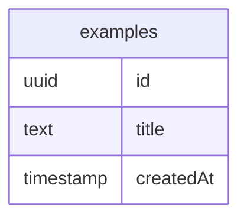

<!-- generated-by: scripts/generate_engineering_docs.py -->
# _starter_nextjs — データモデル・ER図

> 生成日: 2026-07-15 / 対象: `_starter_nextjs` / 確度: [高]
> 実装・manifest・既存資料の静的棚卸しに基づく。外部サービスの稼働状態と本番構成は未検証。

## ER / データフロー

> [中] entity名はschema/migrationから直接検出。属性・関係は誤推測を避けるため、正典schemaで確認できないものを補完していない。

## Entity台帳

| Entity | 検出field | 根拠 | 未確認事項 |
|---|---|---|---|
| `examples` | `id: uuid`, `title: text`, `createdAt: timestamp` | `src/lib/db/schema.ts` | constraint/retention確認 |

## Relation台帳

- relationを静的検出できず。relation定義・外部キー・application joinを確認

## 変更時の実務チェック

- schema/migration正典: `src/lib/db/schema.ts`
- API影響: APIとの結線を検索
- tenant/user境界、主キー、一意制約、外部キー、削除方式、seed/fixtureをmigrationと照合する。
- migration/apply前にbackup、forward/backward compatibility、rollback可否をレビューする。
